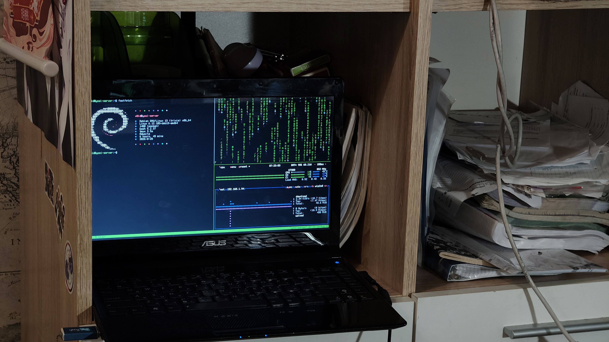

# YOSI

```{=html}
<p align="center">
```
`<strong>`{=html}Прототип клиент-серверной системы для
автоматизированной сборки и установки программ из исходного
кода.`</strong>`{=html}
```{=html}
</p>
```
```{=html}
<p align="center">
```
`<a href="https://yosi-repo.ru">`{=html}🌐 Сайт проекта`</a>`{=html} •
`<a href="https://repo.yosi-repo.ru/v1/index.json">`{=html}📦
Репозиторий`</a>`{=html}
```{=html}
</p>
```
> **Dumb server. Smart client.**

------------------------------------------------------------------------

## 🇷🇺 Русская версия

### Что такое YOSI?

**YOSI** --- экспериментальный source-based пакетный менеджер для Linux
и учебный проект, цель которого --- разобраться, как устроена
автоматизация сборки программ из исходного кода.

Обычная ручная установка из исходников состоит из множества
повторяющихся действий: скачать исходный код, проверить его, разобраться
с зависимостями, собрать программу, установить её и не забыть, какие
файлы появились в системе.

YOSI постепенно автоматизирует этот процесс, оставляя его при этом
понятным и контролируемым.

Проект **не пытается заменить `apt`, `pacman` или другие полноценные
пакетные менеджеры**. Это экспериментальная система, создаваемая с нуля
для изучения принципов работы пакетных менеджеров и source-based
дистрибутивов.

### Как это устроено?

``` text
             GitHub
                │
                ▼
        YOSI Repository
      repo.yosi-repo.ru
                │
              HTTPS
                │
                ▼
           YOSI Client
                │
     ┌──────────┼──────────┐
     ▼          ▼          ▼
  metadata   verification  build
                             │
                             ▼
                          install
```

Сервер YOSI намеренно остаётся простым: он хранит и раздаёт метаданные
репозитория и файлы пакетов по HTTPS.

Основная логика находится на клиенте: получение метаданных, проверка
исходников, разрешение зависимостей, сборка, установка и локальный учёт
пакетов.

### 🌐 Живая инфраструктура

Проект уже имеет собственную публичную инфраструктуру:

-   **Сайт:** https://yosi-repo.ru
-   **Repository API:** https://repo.yosi-repo.ru/v1/index.json
-   **Исходный код:** https://github.com/developv0id/yosi

Репозиторий и сайт размещаются на самостоятельно администрируемом
сервере под Debian с nginx и HTTPS.

### 🚧 Статус проекта

YOSI находится в активной разработке.

Уже заложена структура Go-проекта, реализован базовый CLI, описаны
структуры метаданных репозитория и начата реализация HTTP-клиента для
получения индекса с сервера.

Следующие крупные этапы --- разбор метаданных пакетов, поиск,
зависимости, проверка исходников, сборка, staging, установка, локальная
база состояния, обновления и rollback.

> YOSI пока не предназначен для использования как production-пакетный
> менеджер.

### 🐱 Infrastructure Supervisor


**Йося** --- неофициальный Infrastructure Supervisor проекта YOSI.

В её обязанности входит контроль кабелей, наблюдение за разработкой и
критическая проверка сомнительных архитектурных решений.

> Изображение появится после добавления файла
> `docs/images/yosya-infrastructure.jpg` в репозиторий.

### 📸 YOSI Server



Публичная часть инфраструктуры YOSI работает не только на абстрактном
облачном сервисе: для проекта используется собственный физический
Debian-сервер.

> Изображение появится после добавления файла
> `docs/images/yosi-server.jpg` в репозиторий.

### Технологии

-   **Go** --- клиент YOSI;
-   **Git / GitHub** --- разработка и история проекта;
-   **Debian** --- сервер репозитория;
-   **nginx** --- раздача сайта и репозитория;
-   **HTTPS / TLS** --- защищённый транспорт;
-   **JSON** --- индекс и метаданные репозитория.

### Структура проекта

``` text
.
├── cmd/
│   └── yosi/
├── internal/
│   ├── repo/
│   ├── resolver/
│   ├── builder/
│   ├── installer/
│   └── db/
├── packages/
├── docs/
├── tests/
└── go.mod
```

Архитектура и формат пакетов могут изменяться по мере разработки.

------------------------------------------------------------------------

## 🇬🇧 English version

### What is YOSI?

**YOSI** is an experimental source-based package management system for
Linux and an educational project focused on understanding how software
can be built and installed from source automatically.

A manual source installation usually requires the same sequence of
repetitive operations: downloading sources, verifying them, resolving
dependencies, building the software, installing it and keeping track of
the resulting files.

YOSI aims to automate this workflow while keeping the process
understandable and controllable.

The project **is not intended to replace `apt`, `pacman`, or other
production package managers**. It is an experimental system built from
scratch to explore package-management and source-based Linux concepts.

### Architecture

``` text
             GitHub
                │
                ▼
        YOSI Repository
      repo.yosi-repo.ru
                │
              HTTPS
                │
                ▼
           YOSI Client
                │
     ┌──────────┼──────────┐
     ▼          ▼          ▼
  metadata   verification  build
                             │
                             ▼
                          install
```

The YOSI server is intentionally simple. It distributes repository
metadata and package files over HTTPS.

Most of the logic belongs to the client: fetching metadata, verifying
sources, resolving dependencies, building packages, installing them and
maintaining local package state.

### 🌐 Live infrastructure

-   **Website:** https://yosi-repo.ru
-   **Repository API:** https://repo.yosi-repo.ru/v1/index.json
-   **Source code:** https://github.com/developv0id/yosi

The website and repository are hosted on a self-managed Debian server
running nginx and HTTPS.

### 🚧 Project status

YOSI is under active development.

The Go project structure, basic CLI and repository metadata structures
are already in place, and development of the HTTP repository client has
begun.

The next major stages include package metadata parsing, search,
dependency resolution, source verification, building, staging,
installation, local state tracking, upgrades and rollback.

> YOSI is not ready to be used as a production package manager.

### 🐱 Infrastructure Supervisor


**Yosya** is the unofficial Infrastructure Supervisor of YOSI.

Her responsibilities include cable inspection, development supervision
and critical review of questionable architectural decisions.

### 📸 YOSI Server


YOSI's public infrastructure is hosted on a real self-managed Debian
machine rather than existing only as an abstract diagram.

### Technologies

-   **Go** --- YOSI client;
-   **Git / GitHub** --- development and version control;
-   **Debian** --- repository server;
-   **nginx** --- website and repository delivery;
-   **HTTPS / TLS** --- secure transport;
-   **JSON** --- repository index and metadata.

------------------------------------------------------------------------

## Author

Created by **v0id@SergeyV**.

YOSI is an experimental project. The architecture, package format and
CLI may change during development.
